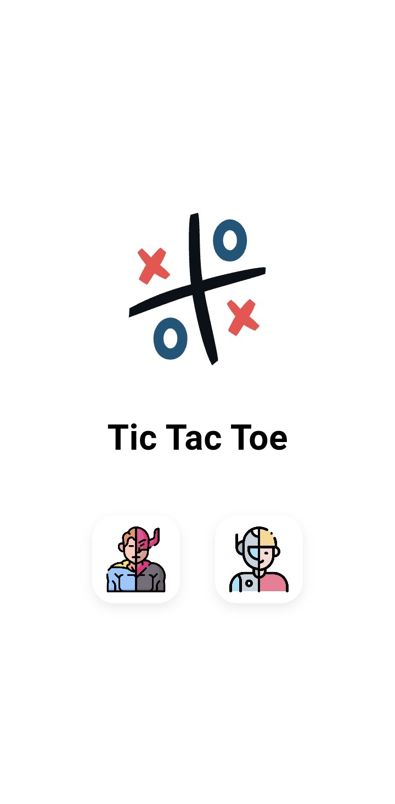
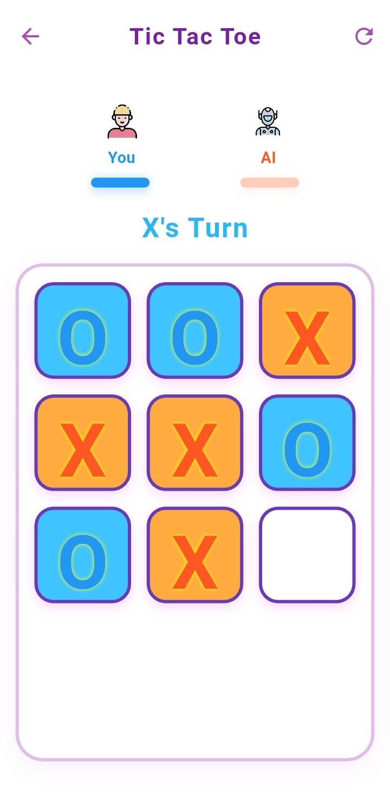
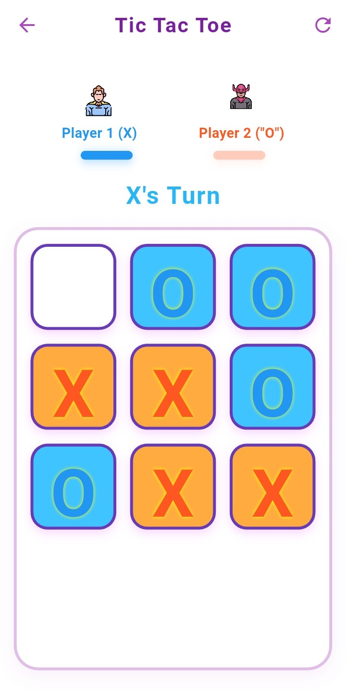

# Colorful Tic Tac Toe 🎮

A modern, playful Tic Tac Toe game designed for children, built with Flutter. Features beautiful animations, unbeatable AI, and a responsive design optimized for Android phones.

## ✨ Features

- **Animated Splash Screen** - Heart-beating logo animation with asset preloading
- **Two Game Modes**:
  - Player vs Player - Human vs Devil themed avatars
  - Player vs AI - Kid vs AI themed avatars with unbeatable minimax algorithm
- **Modern UI/UX**:
  - Colorful, child-friendly interface
  - Smooth animations and transitions
  - Confetti celebration on wins
  - Dynamic player indicators with progress bars
- **Responsive Design** - Optimized for all Android phone screen sizes
- **Clean Architecture** - Well-organized, maintainable codebase

## 🎯 Game Modes

### Player vs Player
Two human players take turns with themed avatars (Human vs Devil)

### Player vs AI
Challenge an unbeatable AI powered by the minimax algorithm

## 🛠️ Technical Features

- **State Management** - Provider pattern for clean state management
- **Custom Animations** - Scale transitions, confetti effects, and smooth UI animations
- **Asset Optimization** - SVG and PNG asset preloading for better performance
- **Responsive Layout** - MediaQuery-based sizing for different screen dimensions
- **Modular Architecture** - Separated screens, widgets, and business logic

## 📱 Screenshots

| Splash Screen | Game Mode Selection | Player vs AI |
|---------------|-------------------|-------------|
|  |  |  |

| Player vs Player 
|-----------------|
|  |

## 🚀 Getting Started

### Prerequisites
- Flutter SDK (3.7.2 or higher)
- Dart SDK
- Android Studio or VS Code
- Android device/emulator

### Installation

1. **Clone the repository**
   ```bash
   git clone https://github.com/yourusername/autottc.git
   cd autottc
   ```

2. **Install dependencies**
   ```bash
   flutter pub get
   ```

3. **Run the app**
   ```bash
   flutter run
   ```

## 📁 Project Structure

```
lib/
├── main.dart                    # App entry point
├── screens/
│   ├── splash_screen.dart       # Animated splash screen
│   ├── game_mode_screen.dart    # Game mode selection
│   └── tic_tac_toe_screen.dart  # Main game screen
├── widgets/
│   ├── logo_button.dart         # Reusable logo button
│   ├── animated_text.dart       # Animated text widget
│   └── game_mode_button.dart    # Game mode selection button
├── tic_tac_toe_viewmodel.dart   # Game logic and AI
└── confetti_widget.dart         # Win celebration effect

assets/
├── logo.svg                     # App logo
├── Kid.png, AI.png             # Player vs AI avatars
├── Men.png, Devil.png          # Player vs Player avatars
└── ...                         # Additional game assets
```

## 🤖 AI Implementation

The AI uses the **minimax algorithm** with the following features:
- Unbeatable gameplay (never loses)
- Optimal move selection
- Efficient decision making
- Responsive gameplay experience

## 🎨 Design Principles

- **Child-Friendly** - Bright colors, large buttons, clear visual feedback
- **Accessibility** - High contrast, readable fonts, intuitive navigation
- **Performance** - Smooth animations, asset preloading, responsive UI
- **Maintainability** - Clean code structure, separated concerns, reusable components

## 🔧 Dependencies

- `flutter/material.dart` - Material Design components
- `provider` - State management
- `flutter_svg` - SVG asset support

## 🤝 Contributing

1. Fork the repository
2. Create your feature branch (`git checkout -b feature/AmazingFeature`)
3. Commit your changes (`git commit -m 'Add some AmazingFeature'`)
4. Push to the branch (`git push origin feature/AmazingFeature`)
5. Open a Pull Request

## 📝 Future Enhancements

- [ ] Sound effects and background music
- [ ] Multiple difficulty levels for AI
- [ ] Game statistics and history
- [ ] Online multiplayer support
- [ ] Themes and customization options
- [ ] Accessibility improvements

## 📄 License

This project is licensed under the MIT License - see the [LICENSE](LICENSE) file for details.

## 👏 Acknowledgments

- Flutter team for the amazing framework
- Material Design for UI guidelines
- Open source community for inspiration
